[](README.md) [](README_zh.md) [](README_zh-TW.md)

---

# 🎬 Awesome Seedance 2.5 Video Prompts

A curated collection of high-quality video generation prompts for ByteDance's Seedance 2.5, covering cinematic storytelling, product ads, reference-based generation, multilingual typography, and controlled video editing.

---

<a id="table-of-contents"></a>
## 📖 Table of Contents

- [🌐 Video Examples](#video-examples)
- [🤔 What is Seedance 2.5?](#what-is-seedance-25)
- [⭐ Featured Prompts](#featured-prompts)
- [🎬 All Prompts](#all-prompts)
- [📥 Video Download List](#video-download-list)
- [🤝 How to Contribute](#how-to-contribute)
- [📄 License](#license)
- [🙏 Acknowledgements](#acknowledgements)

---

<a id="video-examples"></a>
## 🌐 Video Examples

<div align="center">

**[Seedance 2.5 video prompt examples](https://kinovi.ai/blogs/awesome-seedance-2-5-video-prompts)** · **[Seedance 2.5 AI video generator](https://kinovi.ai/models/seedance2-5)**

</div>

---

<a id="what-is-seedance-25"></a>
## 🤔 What is Seedance 2.5?

Seedance 2.5 is ByteDance's next-generation Seedance video model for longer, richer, higher-resolution, and more controllable AI video production. It is especially useful for cinematic prompts, product videos, multi-reference scenes, and targeted video edits. You can try these workflows with the [Seedance 2.5 AI video generator](https://kinovi.ai/models/seedance2-5).

**Key Features:**
- 🎬 **30-second native video — Create longer single-clip outputs for ads, product demos, educational clips, and story-driven sequences.**
- 🧩 **Rich multimodal references — Guide generations with character images, product materials, style boards, motion clips, audio direction, brand assets, and 3D references.**
- ✂️ **Controllable video editing — Adjust backgrounds, replace products, change models, or refine local details while preserving the larger shot.**
- 📐 **Production-oriented quality — Built around smoother motion, stronger character consistency, better prompt adherence, and 4K-oriented workflows.**
- 🔁 **Flexible workflows — Supports text-to-video, image-to-video, video-to-video, multi-reference generation, first/last-frame keyframes, and targeted edits.**

---

<a id="featured-prompts"></a>
## 🔥 Featured Prompts

> ⭐ Hand-picked hero cases from the Seedance 2.5 promotion page

### No. 1: Steampunk Clockwork Odyssey


#### 📖 Description

Steampunk Clockwork Odyssey is a Seedance 2.5 first screen case from the Volcano Ark Seedance 2.5 promotion page, preserving the original scene direction, timing notes, visual style, and reference placeholders.

#### 📝 Prompt

```
A premium, highly cinematic 30-second 3D motion-graphics sequence in an exquisite steampunk and vintage miniature-landscape style, paired with continuous, fluid orbiting and penetrating camera movement.
[0-10s]: Macro close-up of an antique brass clock face. It miraculously unfolds layer by layer into interlocking rotating gear rings and volumetric mist. The camera dives downward through the gears as a mechanical ornithopter spirals upward from a miniature canyon made of stacked aged books.
[10-20s]: The camera glides forward along the ornithopter's path and seamlessly passes into a rapidly spinning ornate brass zoetrope, where galloping mechanical horses appear as projected light and shadow. The projection leaps out of the box, instantly transforming into a brass levitating cable car traveling along glowing copper rails through a forest of mechanical gears, bathed in cinematic golden-hour light.
[20-30s]: The camera elegantly pans downward. Below the cable car, a delicate wind-up wooden mechanical sailing ship cuts through deep-blue glass waves. At the end of the waves, the scene seamlessly evolves into a glowing giant moon. Silhouettes of explorers holding swaying lanterns struggle along a crystal-vein mountain ridge beneath the stars. The camera spirals smoothly outward through ethereal clouds and returns to the grand ticking brass clock face.
Technical specifications: hyper-real mechanical textures, rich brass and gold tones, cinematic shallow depth of field. Smooth, continuous seamless travel shots, with a strong epic feeling and fantasy-adventure atmosphere.
```

#### 🎬 Video

<div align="center">

<a href="https://kinovi.ai/blogs/awesome-seedance-2-5-video-prompts#1-steampunk-clockwork-odyssey">
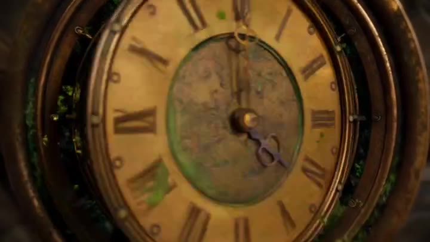
</a>

**[View the Steampunk Clockwork Odyssey video prompt](https://kinovi.ai/blogs/awesome-seedance-2-5-video-prompts#1-steampunk-clockwork-odyssey)**

</div>

#### 📌 Details

- **Source:** [Volcano Ark Seedance 2.5 Promotion Page](https://ark.volcengine.com/promotion?modelName=seedance-2-5)
- **Category:** First Screen

---

### No. 2: Crystal Ball Match-Cut Brand Film


#### 📖 Description

Crystal Ball Match-Cut Brand Film is a Seedance 2.5 first screen case from the Volcano Ark Seedance 2.5 promotion page, preserving the original scene direction, timing notes, visual style, and reference placeholders.

#### 📝 Prompt

```
A fast-paced, cinematic match-cut short film synchronized to dynamic electronic beats. A flawless crystal ball remains fixed at the center of the frame throughout, with a glowing "seedance" logo engraved inside. The crystal ball stays in extremely sharp focus while the background switches at high speed in perfect sync with powerful music hits.
Scene 1: Macro close-up. Cinematic water splashes fly around the crystal ball, refracting complex light and shadow.
Scene 2: Morning vintage cafe. The crystal ball sits on a raw wooden tabletop; the background shows rising coffee steam and blurred commuters outside the window.
Scene 3: Golden-hour evening. A skateboarder casually tosses and catches the crystal ball with one hand; the background is a rapidly receding street scene with beautiful sunset backlight.
Scene 4: A feverish music festival. Hands raise the crystal ball high, refracting dazzling stage lasers in the background.
Scene 5: A lively family-party dining table. The crystal ball rests in the center, surrounded by blurred figures clinking glasses and reaching for food.
Scene 6: A dim cinema. Two hands hold the crystal ball while faint light from a giant screen flows across its surface.
Scene 7: The crystal ball sits on a violently vibrating speaker diaphragm, then cuts seamlessly with the music climax to the center of spinning DJ turntables.
Scene 8: Outdoor camping at night. The background becomes warm campfire light and swaying string-light bokeh.
Final toss: On the final bass hit, the crystal ball is thrown high out of the top of the frame. Cut instantly to a pure black background, with minimalist white text "seedance" appearing in the center.
Edit tightly to the energetic BGM rhythm with beat-matched transitions. Use top-tier cinematic color grading, realistic glass refraction and transmission, complex ray tracing, and global illumination. Keep the subject ultra-sharp while the background carries strong dynamic blur and high visual impact.
```

#### 🎬 Video

<div align="center">

<a href="https://kinovi.ai/blogs/awesome-seedance-2-5-video-prompts#2-crystal-ball-match-cut-brand-film">
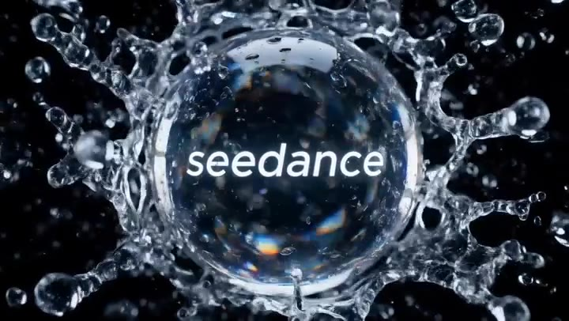
</a>

**[View the Crystal Ball Match-Cut Brand Film video prompt](https://kinovi.ai/blogs/awesome-seedance-2-5-video-prompts#2-crystal-ball-match-cut-brand-film)**

</div>

#### 📌 Details

- **Source:** [Volcano Ark Seedance 2.5 Promotion Page](https://ark.volcengine.com/promotion?modelName=seedance-2-5)
- **Category:** First Screen

---

### No. 3: Window-to-Eye Concept Film


#### 📖 Description

Window-to-Eye Concept Film is a Seedance 2.5 first screen case from the Volcano Ark Seedance 2.5 promotion page, preserving the original scene direction, timing notes, visual style, and reference placeholders.

#### 📝 Prompt

```
A cinematic brand-concept short film. <<<image_1_1>>> is the first frame. The image shakes slightly as the camera slowly pushes in toward tree shadows rapidly receding outside the window. The retreating shadows accelerate, then suddenly cut to <<<image_2_2>>> where the speed slows dramatically and the camera glides gently forward along a stream with birdsong and flowers.
The camera tilts downward into the water, with bubble sound effects underwater. A group of orange jellyfish swims gracefully past the lens <<<image_3_3>>>. The camera slowly pulls back; a school of small fish crosses the frame and moves from the water into the window interior <<<image_4_4>>>. A girl looks left and right, watching the fish.
The camera slowly pulls back and the image falls out of focus. It refocuses as the picture becomes clear again, then switches to the rhythm of the music: Chinese garden flower window <<<image_5_5>>> with rotating light, church stained-glass window, airplane cabin window, dome skylight, bay window, venetian blinds, European dormer window, door peephole, camera viewfinder frame, bird eye, and finally a human-eye close-up.
The image holds on the human eye close-up. The eye closes and the screen goes black, then suddenly opens again, revealing "seedance" at the center of the eye on a bass hit.
```

#### 🎬 Video

<div align="center">

<a href="https://kinovi.ai/blogs/awesome-seedance-2-5-video-prompts#3-window-to-eye-concept-film">
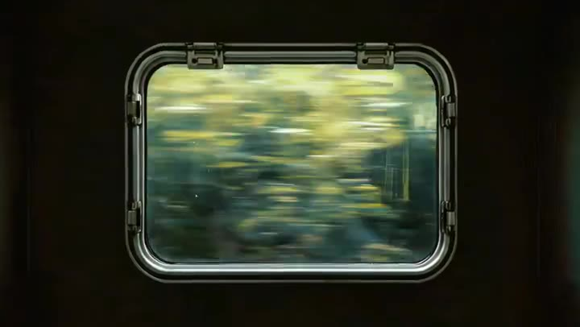
</a>

**[View the Window-to-Eye Concept Film video prompt](https://kinovi.ai/blogs/awesome-seedance-2-5-video-prompts#3-window-to-eye-concept-film)**

</div>

#### 📌 Details

- **Source:** [Volcano Ark Seedance 2.5 Promotion Page](https://ark.volcengine.com/promotion?modelName=seedance-2-5)
- **Category:** First Screen
- **Reference Inputs:** 5

---

<a id="all-prompts"></a>
## 🎬 All Prompts

### No. 1: Steampunk Clockwork Odyssey


#### 📖 Description

Steampunk Clockwork Odyssey is a Seedance 2.5 first screen case from the Volcano Ark Seedance 2.5 promotion page, preserving the original scene direction, timing notes, visual style, and reference placeholders.

#### 📝 Prompt

```
A premium, highly cinematic 30-second 3D motion-graphics sequence in an exquisite steampunk and vintage miniature-landscape style, paired with continuous, fluid orbiting and penetrating camera movement.
[0-10s]: Macro close-up of an antique brass clock face. It miraculously unfolds layer by layer into interlocking rotating gear rings and volumetric mist. The camera dives downward through the gears as a mechanical ornithopter spirals upward from a miniature canyon made of stacked aged books.
[10-20s]: The camera glides forward along the ornithopter's path and seamlessly passes into a rapidly spinning ornate brass zoetrope, where galloping mechanical horses appear as projected light and shadow. The projection leaps out of the box, instantly transforming into a brass levitating cable car traveling along glowing copper rails through a forest of mechanical gears, bathed in cinematic golden-hour light.
[20-30s]: The camera elegantly pans downward. Below the cable car, a delicate wind-up wooden mechanical sailing ship cuts through deep-blue glass waves. At the end of the waves, the scene seamlessly evolves into a glowing giant moon. Silhouettes of explorers holding swaying lanterns struggle along a crystal-vein mountain ridge beneath the stars. The camera spirals smoothly outward through ethereal clouds and returns to the grand ticking brass clock face.
Technical specifications: hyper-real mechanical textures, rich brass and gold tones, cinematic shallow depth of field. Smooth, continuous seamless travel shots, with a strong epic feeling and fantasy-adventure atmosphere.
```

#### 🎬 Video

<div align="center">

<a href="https://kinovi.ai/blogs/awesome-seedance-2-5-video-prompts#1-steampunk-clockwork-odyssey">

</a>

**[View the Steampunk Clockwork Odyssey video prompt](https://kinovi.ai/blogs/awesome-seedance-2-5-video-prompts#1-steampunk-clockwork-odyssey)**

</div>

#### 📌 Details

- **Source:** [Volcano Ark Seedance 2.5 Promotion Page](https://ark.volcengine.com/promotion?modelName=seedance-2-5)
- **Category:** First Screen

---

### No. 2: Crystal Ball Match-Cut Brand Film


#### 📖 Description

Crystal Ball Match-Cut Brand Film is a Seedance 2.5 first screen case from the Volcano Ark Seedance 2.5 promotion page, preserving the original scene direction, timing notes, visual style, and reference placeholders.

#### 📝 Prompt

```
A fast-paced, cinematic match-cut short film synchronized to dynamic electronic beats. A flawless crystal ball remains fixed at the center of the frame throughout, with a glowing "seedance" logo engraved inside. The crystal ball stays in extremely sharp focus while the background switches at high speed in perfect sync with powerful music hits.
Scene 1: Macro close-up. Cinematic water splashes fly around the crystal ball, refracting complex light and shadow.
Scene 2: Morning vintage cafe. The crystal ball sits on a raw wooden tabletop; the background shows rising coffee steam and blurred commuters outside the window.
Scene 3: Golden-hour evening. A skateboarder casually tosses and catches the crystal ball with one hand; the background is a rapidly receding street scene with beautiful sunset backlight.
Scene 4: A feverish music festival. Hands raise the crystal ball high, refracting dazzling stage lasers in the background.
Scene 5: A lively family-party dining table. The crystal ball rests in the center, surrounded by blurred figures clinking glasses and reaching for food.
Scene 6: A dim cinema. Two hands hold the crystal ball while faint light from a giant screen flows across its surface.
Scene 7: The crystal ball sits on a violently vibrating speaker diaphragm, then cuts seamlessly with the music climax to the center of spinning DJ turntables.
Scene 8: Outdoor camping at night. The background becomes warm campfire light and swaying string-light bokeh.
Final toss: On the final bass hit, the crystal ball is thrown high out of the top of the frame. Cut instantly to a pure black background, with minimalist white text "seedance" appearing in the center.
Edit tightly to the energetic BGM rhythm with beat-matched transitions. Use top-tier cinematic color grading, realistic glass refraction and transmission, complex ray tracing, and global illumination. Keep the subject ultra-sharp while the background carries strong dynamic blur and high visual impact.
```

#### 🎬 Video

<div align="center">

<a href="https://kinovi.ai/blogs/awesome-seedance-2-5-video-prompts#2-crystal-ball-match-cut-brand-film">

</a>

**[View the Crystal Ball Match-Cut Brand Film video prompt](https://kinovi.ai/blogs/awesome-seedance-2-5-video-prompts#2-crystal-ball-match-cut-brand-film)**

</div>

#### 📌 Details

- **Source:** [Volcano Ark Seedance 2.5 Promotion Page](https://ark.volcengine.com/promotion?modelName=seedance-2-5)
- **Category:** First Screen

---

### No. 3: Window-to-Eye Concept Film


#### 📖 Description

Window-to-Eye Concept Film is a Seedance 2.5 first screen case from the Volcano Ark Seedance 2.5 promotion page, preserving the original scene direction, timing notes, visual style, and reference placeholders.

#### 📝 Prompt

```
A cinematic brand-concept short film. <<<image_1_1>>> is the first frame. The image shakes slightly as the camera slowly pushes in toward tree shadows rapidly receding outside the window. The retreating shadows accelerate, then suddenly cut to <<<image_2_2>>> where the speed slows dramatically and the camera glides gently forward along a stream with birdsong and flowers.
The camera tilts downward into the water, with bubble sound effects underwater. A group of orange jellyfish swims gracefully past the lens <<<image_3_3>>>. The camera slowly pulls back; a school of small fish crosses the frame and moves from the water into the window interior <<<image_4_4>>>. A girl looks left and right, watching the fish.
The camera slowly pulls back and the image falls out of focus. It refocuses as the picture becomes clear again, then switches to the rhythm of the music: Chinese garden flower window <<<image_5_5>>> with rotating light, church stained-glass window, airplane cabin window, dome skylight, bay window, venetian blinds, European dormer window, door peephole, camera viewfinder frame, bird eye, and finally a human-eye close-up.
The image holds on the human eye close-up. The eye closes and the screen goes black, then suddenly opens again, revealing "seedance" at the center of the eye on a bass hit.
```

#### 🎬 Video

<div align="center">

<a href="https://kinovi.ai/blogs/awesome-seedance-2-5-video-prompts#3-window-to-eye-concept-film">

</a>

**[View the Window-to-Eye Concept Film video prompt](https://kinovi.ai/blogs/awesome-seedance-2-5-video-prompts#3-window-to-eye-concept-film)**

</div>

#### 📌 Details

- **Source:** [Volcano Ark Seedance 2.5 Promotion Page](https://ark.volcengine.com/promotion?modelName=seedance-2-5)
- **Category:** First Screen
- **Reference Inputs:** 5

---

### No. 4: Multilingual Creative Typography Loop


#### 📖 Description

Multilingual Creative Typography Loop is a Seedance 2.5 user works case from the Volcano Ark Seedance 2.5 promotion page, preserving the original scene direction, timing notes, visual style, and reference placeholders.

#### 📝 Prompt

```
A 15-second seamless looping creative typography animation video, 4K, 30 fps. Each language lasts about 1.2 seconds. Transitions are created through text dissolving, morphing, or drifting into particles, with no hard cuts. The background music has a clear rhythm and strong beat hits.
0-1.2s Chinese "创造" (Create): Op-art pure black background. Black-and-white concentric circles expand outward from the center to form a visual tunnel. The white 3D Chinese characters "创造" slowly protrude from the center toward the camera in bold sans-serif form, with subtle edge shadows. The circles ripple and distort like water as the text advances.
1.2-2.4s English "Create": The Chinese characters dissolve into ink-like particles and reassemble into "Create". Neon cyan and magenta gradients flow across the letters. The background becomes a dark grid with scanning light beams. The word stretches slightly with elastic motion on the beat.
2.4-3.6s Japanese "創造": The English letters shatter into paper-like fragments and fold into Japanese kanji. The background becomes warm washi paper texture with soft gold dust. The characters appear as brush ink, then gain a glossy lacquer edge.
3.6-4.8s Korean "창조": Ink strokes curve into Hangul. The background shifts to a clean white design space with floating geometric blocks. The text is pearl white with a fine blue rim light.
4.8-6.0s French "Créer": Letters bloom like perfume vapor over a deep burgundy background. The accent mark appears as a small sparkling stroke, landing precisely on the beat.
6.0-7.2s Spanish "Crear": Warm orange and deep blue mosaic tiles rotate into place. The text becomes sunlit, thick, and sculptural, with long shadows sliding across it.
7.2-8.4s Arabic "إبداع": Particles sweep from right to left and become elegant Arabic calligraphy. The background turns midnight blue with gold star-like specks. The strokes glow softly and flow like liquid metal.
8.4-9.6s Hindi "सृजन": The letters emerge from colorful powder and festival-like particles. The background carries saffron, teal, and pink gradients, with soft cloth texture.
9.6-10.8s Thai "สร้างสรรค์": The typography forms from water ripples and glass reflections. The background is a luminous tropical green with highlights like sunlight through leaves.
10.8-12.0s Russian "Создавать": The text appears as frosted crystal on a cold blue background. Fine ice particles fly outward as the letters lock into place.
12.0-13.2s Portuguese "Criar": The letters swing in with a playful tiled-wave motion, using bright green and yellow accents. The background feels clean, sunny, and energetic.
13.2-15.0s Finale: All words from different languages orbit inward as particles and assemble around the central Chinese "创造" and English "Create". The background becomes a deep black stage with a radiant circular light ring. The final frame holds briefly, then the light ring collapses back into the first concentric-circle tunnel, creating a perfect loop.
```

#### 🎬 Video

<div align="center">

<a href="https://kinovi.ai/blogs/awesome-seedance-2-5-video-prompts#4-multilingual-creative-typography-loop">
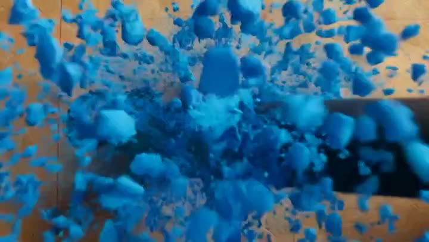
</a>

**[View the Multilingual Creative Typography Loop video prompt](https://kinovi.ai/blogs/awesome-seedance-2-5-video-prompts#4-multilingual-creative-typography-loop)**

</div>

#### 📌 Details

- **Source:** [Volcano Ark Seedance 2.5 Promotion Page](https://ark.volcengine.com/promotion?modelName=seedance-2-5)
- **Category:** User Works
- **Scenario:** 视觉特效
- **Aspect Ratio:** 16 / 9

---

### No. 5: Haute Couture Dream Bokeh Film


#### 📖 Description

Haute Couture Dream Bokeh Film is a Seedance 2.5 user works case from the Volcano Ark Seedance 2.5 promotion page, preserving the original scene direction, timing notes, visual style, and reference placeholders.

#### 📝 Prompt

```
Overall style: a 30-second couture brand-level visual blockbuster with strong cinematic polish and premium texture. Emphasize dreamy bokeh, silky motion-blur transitions, volumetric lighting, and ultra-real material detail.
[0-5s] Dreamlike prologue and macro close-up: an ultra-high-definition macro shot of a slender hand reaching into the air. The fingertips touch colorful star-like bokeh. As the fingers pass through the light, the points of light turn into flowing silk threads and wrap around the wrist.
[5-12s] High-fashion entrance: a model in an elegant couture silhouette walks through a dark reflective space. The dress surface alternates between translucent gauze, liquid metal, and glittering crystals. The camera circles slowly, catching rim light and delicate fabric motion.
[12-20s] Surreal transformation: the bokeh expands into floating flower petals and glass fragments. The model turns gently; light flows across the face and shoulders, and the scene transitions through smooth motion blur into a brighter dreamlike stage.
[20-30s] Finale: the model pauses under a halo of warm light. Silk, petals, and crystal particles spiral upward and dissolve into a clean brand-style ending frame. Keep the tone refined, dreamlike, luxurious, and cinematic.
```

#### 🎬 Video

<div align="center">

<a href="https://kinovi.ai/blogs/awesome-seedance-2-5-video-prompts#5-haute-couture-dream-bokeh-film">
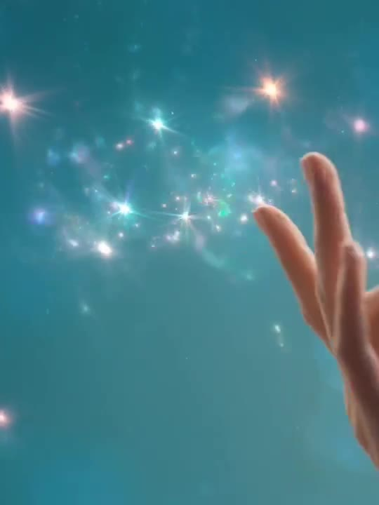
</a>

**[View the Haute Couture Dream Bokeh Film video prompt](https://kinovi.ai/blogs/awesome-seedance-2-5-video-prompts#5-haute-couture-dream-bokeh-film)**

</div>

#### 📌 Details

- **Source:** [Volcano Ark Seedance 2.5 Promotion Page](https://ark.volcengine.com/promotion?modelName=seedance-2-5)
- **Category:** User Works
- **Scenario:** 影视
- **Aspect Ratio:** 3 / 4

---

### No. 6: Deep-Sea Coral Reef Jellyfish Scene


#### 📖 Description

Deep-Sea Coral Reef Jellyfish Scene is a Seedance 2.5 user works case from the Volcano Ark Seedance 2.5 promotion page, preserving the original scene direction, timing notes, visual style, and reference placeholders.

#### 📝 Prompt

```
A deep-sea coral reef scene in a tropical underwater world with a blue overall tone. Large areas of healthy, thriving colorful living coral, including branching coral, brain coral, plate coral, and soft sea-fan coral. Schools of tropical fish swim naturally through the reef. The foreground is clear and vivid; the background gradually shifts blue-gray with reduced contrast. Natural light from above is filtered through seawater, forming soft volumetric beams. Tiny suspended particles and slight water movement are visible. Soft coral sways gently and fish movement is smooth and coordinated. Add a group of translucent pale-purple glowing jellyfish, 8 to 12 in total, slowly appearing in different sizes. Their umbrella bodies pulse gently with flowing tentacles, moving elegantly through the coral reef while the whole scene stays calm, realistic, and dreamlike.
```

#### 🎬 Video

<div align="center">

<a href="https://kinovi.ai/blogs/awesome-seedance-2-5-video-prompts#6-deep-sea-coral-reef-jellyfish-scene">
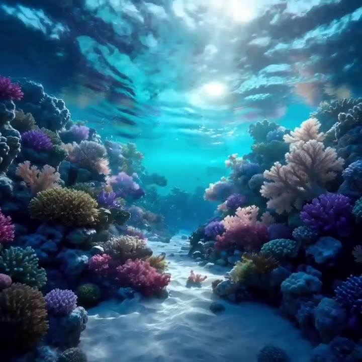
</a>

**[View the Deep-Sea Coral Reef Jellyfish Scene video prompt](https://kinovi.ai/blogs/awesome-seedance-2-5-video-prompts#6-deep-sea-coral-reef-jellyfish-scene)**

</div>

#### 📌 Details

- **Source:** [Volcano Ark Seedance 2.5 Promotion Page](https://ark.volcengine.com/promotion?modelName=seedance-2-5)
- **Category:** User Works
- **Scenario:** 后期特效
- **Aspect Ratio:** 1 / 1

---

### No. 7: Floating Desert Museum Cinematic Film


#### 📖 Description

Floating Desert Museum Cinematic Film is a Seedance 2.5 user works case from the Volcano Ark Seedance 2.5 promotion page, preserving the original scene direction, timing notes, visual style, and reference placeholders.

#### 📝 Prompt

```
Cinematic and premium. A golden desert at dawn. A minimalist white art-museum building floats above the dunes, with delicate stone texture and soft reflections on its surface. Sunlight passes through windblown sand to form volumetric rays, and distant dunes have clear layers. The shot begins with an ultra-wide desert panorama and slowly pushes forward through drifting sand into the floating building. Inside are suspended sculptures, translucent silk installations, and a character wearing a white robe, with the fabric moving naturally in the wind. The camera performs a smooth orbit around the character. At the end, the building walls slowly open, revealing a huge sunrise and a silent desert horizon.
```

#### 🎬 Video

<div align="center">

<a href="https://kinovi.ai/blogs/awesome-seedance-2-5-video-prompts#7-floating-desert-museum-cinematic-film">
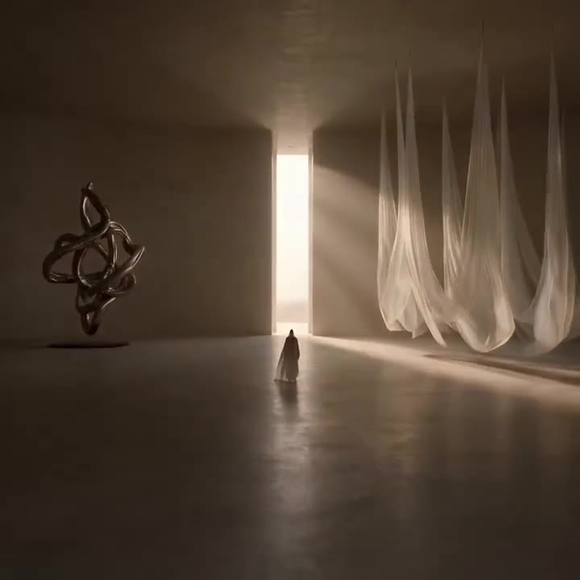
</a>

**[View the Floating Desert Museum Cinematic Film video prompt](https://kinovi.ai/blogs/awesome-seedance-2-5-video-prompts#7-floating-desert-museum-cinematic-film)**

</div>

#### 📌 Details

- **Source:** [Volcano Ark Seedance 2.5 Promotion Page](https://ark.volcengine.com/promotion?modelName=seedance-2-5)
- **Category:** User Works
- **Scenario:** 影视
- **Aspect Ratio:** 1 / 1

---

### No. 8: Retro Suede Boots Brand Concept Film


#### 📖 Description

Retro Suede Boots Brand Concept Film is a Seedance 2.5 user works case from the Volcano Ark Seedance 2.5 promotion page, preserving the original scene direction, timing notes, visual style, and reference placeholders.

#### 📝 Prompt

```
A 30-second premium brand-concept short film with strong visual tension. The opening uses a surreal upside-down perspective. The camera flips with gravity to show a model wearing vintage suede boots stepping lightly across rolling red dunes. Macro close-ups reveal the matte nap of the boot surface and coarse red sand grains clinging to it.
Then cut into a montage full of weightlessness and dreamlike color: young male and female models fall backward lightly through amber wind-sand currents and cold edge rim light. The camera rapidly cuts to razor-sharp facial close-ups, where sand passes over eyelashes dusted with tiny gold particles. Fabrics, hair, and sand move in slow motion.
The middle section shows boots landing on mirror-like wet sand, footsteps turning into rippling liquid gold. The camera glides along the boot edge, then passes through a swirl of red dust into an abstract desert runway. Final shot: the model stands alone on a dune ridge at sunset. Red sand rises behind the body like a curtain, forming a clean, high-fashion brand silhouette. Use cinematic grading, premium commercial texture, realistic suede and sand detail, elegant rhythm, and no clutter.
```

#### 🎬 Video

<div align="center">

<a href="https://kinovi.ai/blogs/awesome-seedance-2-5-video-prompts#8-retro-suede-boots-brand-concept-film">
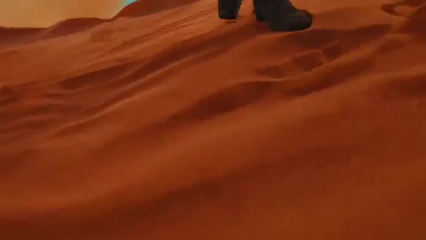
</a>

**[View the Retro Suede Boots Brand Concept Film video prompt](https://kinovi.ai/blogs/awesome-seedance-2-5-video-prompts#8-retro-suede-boots-brand-concept-film)**

</div>

#### 📌 Details

- **Source:** [Volcano Ark Seedance 2.5 Promotion Page](https://ark.volcengine.com/promotion?modelName=seedance-2-5)
- **Category:** User Works
- **Scenario:** 广告宣传
- **Aspect Ratio:** 16 / 9

---

### No. 9: Peking Opera Heritage Short Film


#### 📖 Description

Peking Opera Heritage Short Film is a Seedance 2.5 user works case from the Volcano Ark Seedance 2.5 promotion page, preserving the original scene direction, timing notes, visual style, and reference placeholders.

#### 📝 Prompt

```
A short film about the intangible cultural heritage of Peking Opera, cinematic, warm, restrained, and rooted in Eastern aesthetics. In a traditional troupe backstage area and handcraft workshop, an old master quietly makes opera headdresses, arranges costumes, and paints facial makeup. The hand details are delicate; silk threads, beads, pigments, and embroidered patterns have rich texture. A young apprentice watches seriously nearby, then carefully receives a tool and completes a small step under the master's guidance. The master straightens the apprentice's headwear and collar, as if gently passing on both a craft and an emotion. In the final shot, the young performer is fully dressed and stands beside the stage just before entering. A soft light illuminates the costume and side profile, creating a quiet, moving inheritance moment.
```

#### 🎬 Video

<div align="center">

<a href="https://kinovi.ai/blogs/awesome-seedance-2-5-video-prompts#9-peking-opera-heritage-short-film">
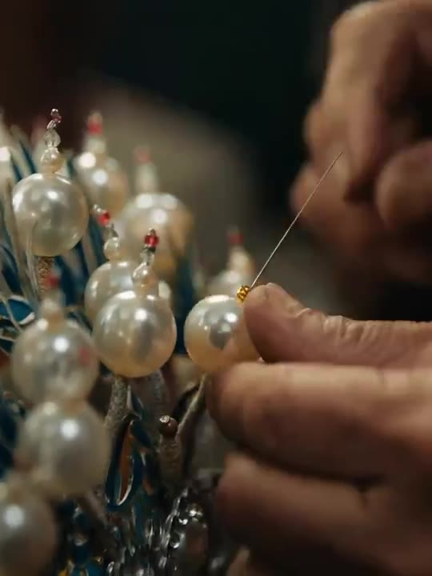
</a>

**[View the Peking Opera Heritage Short Film video prompt](https://kinovi.ai/blogs/awesome-seedance-2-5-video-prompts#9-peking-opera-heritage-short-film)**

</div>

#### 📌 Details

- **Source:** [Volcano Ark Seedance 2.5 Promotion Page](https://ark.volcengine.com/promotion?modelName=seedance-2-5)
- **Category:** User Works
- **Scenario:** 影视
- **Aspect Ratio:** 3 / 4

---

### No. 10: Oceanic Civilization Epic Sci-Fi Film


#### 📖 Description

Oceanic Civilization Epic Sci-Fi Film is a Seedance 2.5 user works case from the Volcano Ark Seedance 2.5 promotion page, preserving the original scene direction, timing notes, visual style, and reference placeholders.

#### 📝 Prompt

```
Theme: "The Fallen Theater: Oceanic Civilization". Epic sci-fi, Dune x Interstellar atmosphere, no real human characters, sculptural lifeforms.
[0-5s | Cosmic opening: the ocean as planetary memory] A deep-blue ocean fills the panoramic frame. The deep water shows layered structures like a liquid universe inside a planet. The camera slowly descends vertically from high altitude, passing through clouds and sea mist into the ocean surface. The surface ripples like metallic film and refracts irregular cracks of sunlight.
[5-10s | Entering the ruins] The camera breaks through the water and continues downward. Giant stone columns and alien temple structures appear beneath the sea. They look like the remains of a lost civilization, covered in coral-like mineral growth. Volumetric light pierces the water, revealing suspended stardust-like particles.
[10-18s | Sculptural lifeforms] Massive sculptural organisms awaken among the ruins. Their bodies resemble stone, shell, and polished metal, moving slowly and solemnly. They do not behave like animals but like living monuments. The camera spirals around them, emphasizing scale, ritual, and sacred silence.
[18-25s | Collapse and reconstruction] The alien temple begins to collapse without chaos. Blocks, columns, and fragments float apart, then reorganize into a new monumental structure. Water currents, dust, and light wrap around the architecture as if an ancient ceremony is being performed.
[25-30s | Abyssal finale] The camera pulls back to reveal the entire oceanic civilization as a colossal temple hidden under the sea. A grand spiral of stardust and water forms above it. The image should feel sacred, lonely, immense, and cinematic, with high dynamic range and realistic sci-fi texture.
```

#### 🎬 Video

<div align="center">

<a href="https://kinovi.ai/blogs/awesome-seedance-2-5-video-prompts#10-oceanic-civilization-epic-sci-fi-film">
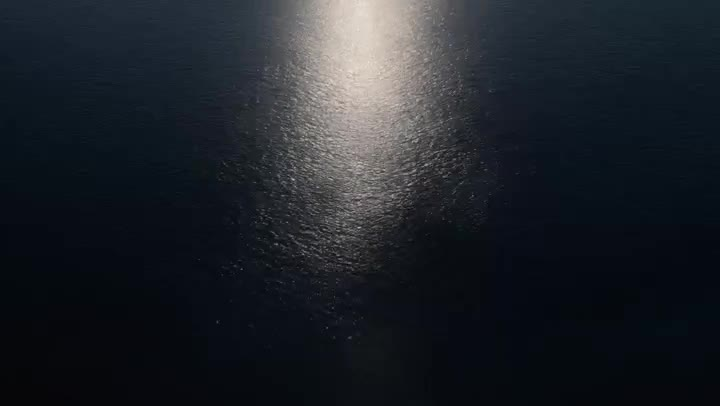
</a>

**[View the Oceanic Civilization Epic Sci-Fi Film video prompt](https://kinovi.ai/blogs/awesome-seedance-2-5-video-prompts#10-oceanic-civilization-epic-sci-fi-film)**

</div>

#### 📌 Details

- **Source:** [Volcano Ark Seedance 2.5 Promotion Page](https://ark.volcengine.com/promotion?modelName=seedance-2-5)
- **Category:** User Works
- **Scenario:** 游戏
- **Aspect Ratio:** 16 / 9

---

### No. 11: Mechanical Flower Bloom Brand Film


#### 📖 Description

Mechanical Flower Bloom Brand Film is a Seedance 2.5 user works case from the Volcano Ark Seedance 2.5 promotion page, preserving the original scene direction, timing notes, visual style, and reference placeholders.

#### 📝 Prompt

```
Theme: "Mechanical Flower Bloom". Highlight the video-generation model's strengths in lighting, art detail, realism, camera movement, and cinematic character. The overall style is a high-end technology brand advertisement with strong visual impact. Use a one-shot macro push-in: begin with a metal flower bud in darkness, gradually enter the precision mechanical structure inside the petals, and end with the mechanical flower fully blooming as light spreads outward in a climactic frame. Require realistic physical lighting, refined metal and glass materials, delicate mechanical motion, stable composition, cinematic color grading, and no text.
```

#### 🎬 Video

<div align="center">

<a href="https://kinovi.ai/blogs/awesome-seedance-2-5-video-prompts#11-mechanical-flower-bloom-brand-film">
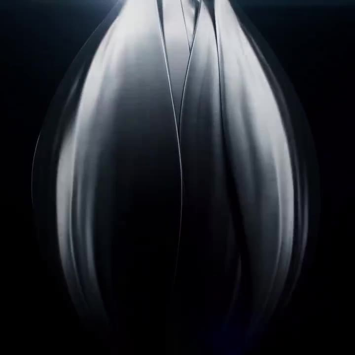
</a>

**[View the Mechanical Flower Bloom Brand Film video prompt](https://kinovi.ai/blogs/awesome-seedance-2-5-video-prompts#11-mechanical-flower-bloom-brand-film)**

</div>

#### 📌 Details

- **Source:** [Volcano Ark Seedance 2.5 Promotion Page](https://ark.volcengine.com/promotion?modelName=seedance-2-5)
- **Category:** User Works
- **Scenario:** 影视
- **Aspect Ratio:** 1 / 1

---

### No. 12: Silk Road Pomegranate Folk Animation


#### 📖 Description

Silk Road Pomegranate Folk Animation is a Seedance 2.5 user works case from the Volcano Ark Seedance 2.5 promotion page, preserving the original scene direction, timing notes, visual style, and reference placeholders.

#### 📝 Prompt

```
Overall style: mineral-pigment flat animation with Eastern and Silk Road decorative aesthetics. Use cinnabar red, ochre, malachite green, ultramarine, and gold accents, with paper and mural textures. Keep the image layered and flat; do not use live-action photography or 3D realism. The rhythm moves from stillness to motion and back to stillness, emphasizing the abundant journey "from land to cup" with lively Western-Regions-style music.
Shot 1, first fruit on the branch, abundant opening (0-4s): Ochre and cinnabar color blocks bloom across a Silk Road painting surface. A pomegranate branch stretches in from the right. Leaves and fruit are outlined with decorative linework. A ripe pomegranate slowly appears, and gold dust glints around it.
Shot 2, fruit splitting and seeds flowing (4-9s): The pomegranate gently opens. Red seeds pour out like jewels, forming rhythmic patterns across the paper. The movement is decorative rather than realistic, with mineral-pigment particles and mural texture.
Shot 3, Silk Road journey (9-16s): The seeds become a flowing red path. Camels, merchants, patterned fabrics, and distant city silhouettes appear as flat decorative motifs. The camera pans horizontally like a handscroll, with layered mountains, clouds, and gold outlines.
Shot 4, harvest and sharing (16-23s): The red path returns to an orchard and a table. Hands place pomegranates, cups, and fruit plates in a symmetrical composition. The palette becomes richer and warmer, creating a festive sense of abundance.
Shot 5, final stillness (23-30s): Pomegranate juice fills a cup. The surface of the liquid reflects gold ornament patterns. The whole image slowly settles into a mural-like poster composition, with fruit, leaves, cups, and Silk Road motifs arranged around the center.
```

#### 🎬 Video

<div align="center">

<a href="https://kinovi.ai/blogs/awesome-seedance-2-5-video-prompts#12-silk-road-pomegranate-folk-animation">
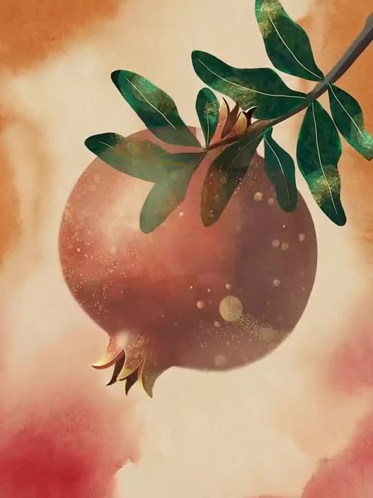
</a>

**[View the Silk Road Pomegranate Folk Animation video prompt](https://kinovi.ai/blogs/awesome-seedance-2-5-video-prompts#12-silk-road-pomegranate-folk-animation)**

</div>

#### 📌 Details

- **Source:** [Volcano Ark Seedance 2.5 Promotion Page](https://ark.volcengine.com/promotion?modelName=seedance-2-5)
- **Category:** User Works
- **Scenario:** 科普
- **Aspect Ratio:** 3 / 4

---

### No. 13: One-Shot Rooms With Shifting Worlds


#### 📖 Description

One-Shot Rooms With Shifting Worlds is a Seedance 2.5 reference generation case from the Volcano Ark Seedance 2.5 promotion page, preserving the original scene direction, timing notes, visual style, and reference placeholders.

#### 📝 Prompt

```
One continuous shot. The camera smoothly follows a person in a black coat (refer to <<<image_1_1>>>) walking from left to right through six connected rooms with different tones and atmospheres. Every room has the same structure: white walls, light herringbone wood floors, French double floor-to-ceiling windows, and white sheer curtains, based on <<<image_2_2>>>. Only the scenery outside the window and the indoor mood change. The protagonist walks at a constant speed and passes through every open doorway in the walls.
0-5s: First room, American-comic fight theme. The protagonist enters and fights a character (<<<image_3_3>>>), who is defeated.
5-10s: Second room, warm felt style. Outside the window is a sunflower field (<<<image_4_4>>>). The room has warm orange soft light, and a painter is painting sunflowers (<<<image_5_5>>>). After entering, the protagonist also becomes felt-style.
10-15s: Third room, sadness theme. The entire image becomes black-and-white comic freeze-frame animation. Rain falls outside, and the interior is cold, gray, and low-key. A person sits alone in an empty room.
15-20s: Fourth room, cyberpunk neon city. The windows reveal rain-soaked skyscrapers and colorful lights. Reflections slide across the floor and the protagonist's coat.
20-25s: Fifth room, festival night. Fireworks fill the sky outside, colorful indoor light flickers, and the protagonist is pulled into a cheering atmosphere.
25-30s: Final room, blank white space. The protagonist stands in the center and snaps their fingers. With the snap sound, the screen turns black and the word "seedance" appears in the center. Overall: cinematic, high-fashion advertising style, with lighting determined entirely by the outside scene, strong emotional contrast, and no extra text.
```

#### 🎬 Video

<div align="center">

<a href="https://kinovi.ai/blogs/awesome-seedance-2-5-video-prompts#13-one-shot-rooms-with-shifting-worlds">
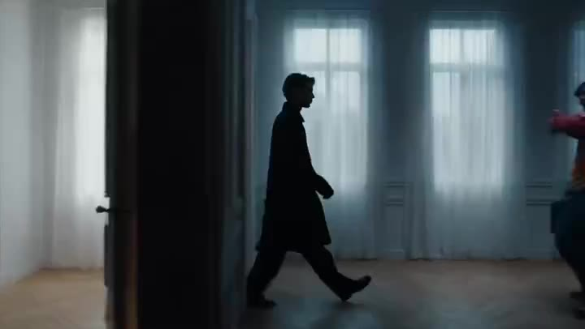
</a>

**[View the One-Shot Rooms With Shifting Worlds video prompt](https://kinovi.ai/blogs/awesome-seedance-2-5-video-prompts#13-one-shot-rooms-with-shifting-worlds)**

</div>

#### 📌 Details

- **Source:** [Volcano Ark Seedance 2.5 Promotion Page](https://ark.volcengine.com/promotion?modelName=seedance-2-5)
- **Category:** Reference Generation
- **Reference Inputs:** 8

---

### No. 14: Three-Thousand-Year Football History


#### 📖 Description

Three-Thousand-Year Football History is a Seedance 2.5 reference generation case from the Volcano Ark Seedance 2.5 promotion page, preserving the original scene direction, timing notes, visual style, and reference placeholders.

#### 📝 Prompt

```
Create a 30-second popular-science short video about the three-thousand-year evolution of football. Use one ball as the visual throughline. The ball rolls, travels, and transforms from ancient times through different civilizations and eras. The pacing is compact, the visuals are refined, and historical educational filmmaking is combined with artistic transitions. Emphasize the feeling of one ball crossing three thousand years, with concise and powerful narration.
Opening: an ancient ball slowly appears from a black background with aged surface texture, then rolls into a Warring States-period Chinese cuju scene. The image becomes ink-wash style, based on <<<image_1_1>>>. Narration: "Long before modern stadiums, people were already chasing a ball."
The ball rolls through ancient streets and transforms into balls from different cultures. It passes through medieval courtyards, early modern grass fields, and industrial-era city grounds. Every transition is driven by the ball rolling through the frame.
In the modern section, the ball becomes a contemporary football. The scene expands into a large stadium under bright lights, with fast passes, running players, and cheering crowds. The ball flies into the air and the camera follows it in slow motion.
Finale: the ball lands at the center of a global field where people from different regions gather. The image should feel grand and epic. Narration: "Today, football connects the world."
```

#### 🎬 Video

<div align="center">

<a href="https://kinovi.ai/blogs/awesome-seedance-2-5-video-prompts#14-three-thousand-year-football-history">
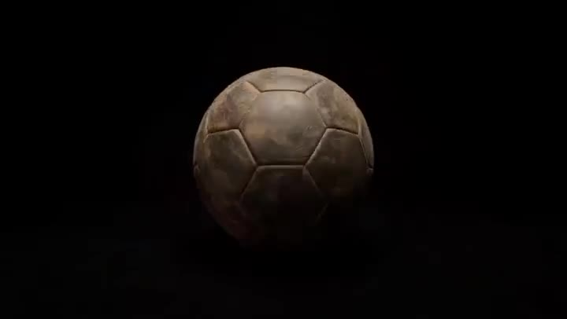
</a>

**[View the Three-Thousand-Year Football History video prompt](https://kinovi.ai/blogs/awesome-seedance-2-5-video-prompts#14-three-thousand-year-football-history)**

</div>

#### 📌 Details

- **Source:** [Volcano Ark Seedance 2.5 Promotion Page](https://ark.volcengine.com/promotion?modelName=seedance-2-5)
- **Category:** Reference Generation
- **Reference Inputs:** 3

---

### No. 15: Capsule Coffee Machine Tutorial


#### 📖 Description

Capsule Coffee Machine Tutorial is a Seedance 2.5 reference generation case from the Volcano Ark Seedance 2.5 promotion page, preserving the original scene direction, timing notes, visual style, and reference placeholders.

#### 📝 Prompt

```
A 30-second tutorial video for installing and using a capsule coffee machine.
0-2s: Opening title text: "seedance Capsule Coffee Machine Installation and Use Tutorial".
2-5s, Step 1: Install the water tank, refer to <<<image_1_1>>>. Shot: medium shot, slightly top-down, camera at the back of the machine. Action: align the water tank with the rear slot and push it vertically downward until it clicks. Requirement: clearly show how the bottom buckle aligns with the body slot; the transparent tank should show the water level. Voice-over: "First, install the water tank."
5-9s, Step 2: Install the drip tray, refer to <<<image_2_2>>>. Shot: close shot, straight-on, front lower body. Action: slide the drip tray horizontally into the bottom guide rail until it fits flush. Requirement: show the tray edge and rail alignment clearly. Voice-over: "Next, push the drip tray into place."
9-14s, Step 3: Insert the capsule. Open the capsule compartment, place a capsule in the correct position, and close the lid. Use close-ups to show the capsule orientation and smooth closing motion. Voice-over: "Place the capsule in the holder and close the lid."
14-20s, Step 4: Place the cup and select mode. Put a cup under the outlet, press the extraction button, and show indicator lights. Voice-over: "Place your cup and choose the extraction mode."
20-27s, Step 5: Coffee extraction. Coffee flows into the cup with rich crema. Use macro close-ups of liquid, bubbles, and steam. Voice-over: "Wait a moment, and a fresh cup of coffee is ready."
27-30s: Final clean product shot. The cup sits beside the machine, steam rising. Add a neat ending frame and a soft confirmation sound.
```

#### 🎬 Video

<div align="center">

<a href="https://kinovi.ai/blogs/awesome-seedance-2-5-video-prompts#15-capsule-coffee-machine-tutorial">

</a>

**[View the Capsule Coffee Machine Tutorial video prompt](https://kinovi.ai/blogs/awesome-seedance-2-5-video-prompts#15-capsule-coffee-machine-tutorial)**

</div>

#### 📌 Details

- **Source:** [Volcano Ark Seedance 2.5 Promotion Page](https://ark.volcengine.com/promotion?modelName=seedance-2-5)
- **Category:** Reference Generation
- **Reference Inputs:** 6

---

### No. 16: Lonely Crowd One-Shot Through Seasons


#### 📖 Description

Lonely Crowd One-Shot Through Seasons is a Seedance 2.5 reference generation case from the Volcano Ark Seedance 2.5 promotion page, preserving the original scene direction, timing notes, visual style, and reference placeholders.

#### 📝 Prompt

```
Core instruction: a 26-second one-shot narrative short film, stable follow shot, interweaving the smooth tracking of <<<video_1_1>>> and the smooth orbit movement of <<<video_2_2>>>. The shot should feel like fluid forward motion. Day and night alternate, and the four seasons flow within the frame. The protagonist is a European woman <<<image_1_3>>> placed within crowds full of everyday life, emphasizing extreme loneliness and cinematic photographic texture.
0-3s, stable rear follow: the camera follows behind her through a crowded morning street. Warm sunlight and moving people create a lively environment, but she remains emotionally distant.
3-7s: The light shifts to noon. The crowd becomes denser. The camera drifts to a side angle and circles slightly, keeping her as the emotional center.
7-11s: Rain begins. The street becomes reflective, umbrellas pass by, and neon signs begin to appear. Her expression remains restrained.
11-15s: The environment transitions into autumn. Leaves move across the frame, the crowd thins, and the color palette becomes amber and gray.
15-20s: Night falls. City lights blur into bokeh while the camera glides around her in a slow orbit. People pass close to the lens, creating occlusion transitions without cuts.
20-26s: The season turns into winter. Fine snow falls. The crowd fades into soft silhouettes. She stops briefly in the center of the moving world and looks upward. The final image should feel lonely, beautiful, and cinematic, with no hard cuts.
```

#### 🎬 Video

<div align="center">

<a href="https://kinovi.ai/blogs/awesome-seedance-2-5-video-prompts#16-lonely-crowd-one-shot-through-seasons">
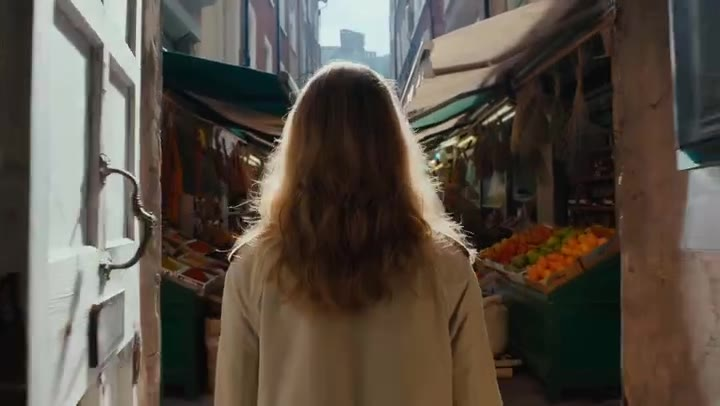
</a>

**[View the Lonely Crowd One-Shot Through Seasons video prompt](https://kinovi.ai/blogs/awesome-seedance-2-5-video-prompts#16-lonely-crowd-one-shot-through-seasons)**

</div>

#### 📌 Details

- **Source:** [Volcano Ark Seedance 2.5 Promotion Page](https://ark.volcengine.com/promotion?modelName=seedance-2-5)
- **Category:** Reference Generation
- **Input Video:** [Reference video](https://ark-common-storage-prod-cn-beijing.tos-cn-beijing.volces.com/presets/experience/gen_video/model-promotion/seedance-2-5/part1/tab2/group1/reference1.mp4)
- **Reference Inputs:** 17

---

### No. 17: Fruit Cookie Commercial


#### 📖 Description

Fruit Cookie Commercial is a Seedance 2.5 reference generation case from the Volcano Ark Seedance 2.5 promotion page, preserving the original scene direction, timing notes, visual style, and reference placeholders.

#### 📝 Prompt

```
Bright, colorful advertising-film style. Fruit-flavored cookies are the main subject, including strawberry, apple, grape, and orange flavors. The strawberry flavor refers to <<<image_1_1>>>. Cookies and their matching fruits are arranged in strong, orderly geometric arrays. The overall image is clean, premium, and rhythmic. The opening uses fruit to quickly establish visual focus, referring to the composition of <<<video_1_2>>> as the music beat enters. Then different flavored cookies are lined up neatly, with close-up cuts inspired by the motion and camera movement of <<<video_2_3>>>. In the climax, one cookie breaks open, fruit juice and crumbs burst outward in a controlled, beautiful way, and the four flavors rotate into a final symmetrical product layout. Use bright lighting, crisp textures, lively rhythm, and no messy background.
```

#### 🎬 Video

<div align="center">

<a href="https://kinovi.ai/blogs/awesome-seedance-2-5-video-prompts#17-fruit-cookie-commercial">
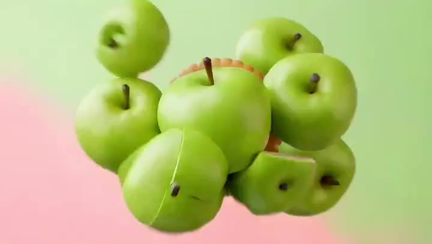
</a>

**[View the Fruit Cookie Commercial video prompt](https://kinovi.ai/blogs/awesome-seedance-2-5-video-prompts#17-fruit-cookie-commercial)**

</div>

#### 📌 Details

- **Source:** [Volcano Ark Seedance 2.5 Promotion Page](https://ark.volcengine.com/promotion?modelName=seedance-2-5)
- **Category:** Reference Generation
- **Input Video:** [Reference video](https://ark-common-storage-prod-cn-beijing.tos-cn-beijing.volces.com/presets/experience/gen_video/model-promotion/seedance-2-5/part1/tab2/group2/reference2.mp4)
- **Reference Inputs:** 7

---

### No. 18: Desert Horned Lizard Grapefruit Ad


#### 📖 Description

Desert Horned Lizard Grapefruit Ad is a Seedance 2.5 reference generation case from the Volcano Ark Seedance 2.5 promotion page, preserving the original scene direction, timing notes, visual style, and reference placeholders.

#### 📝 Prompt

```
3D animated advertisement style, bright and transparent colors, with strong freshness and impact in the fruit flesh and juice. The overall feeling should be like a high-quality commercial animated short with a little exaggerated humor. The desert horned lizard character is cute, lively, and expressive, based on <<<image_1_1>>>. The visual texture should reference the soft natural light, delicate fuzz/skin texture, dreamy macro depth of field, and realistic yet playful feeling in the reference image.
0-3s: A sun-scorched desert. The air is distorted by heat, the sand is hot, and the distance looks smoky. A tiny desert horned lizard crawls slowly, looking exhausted and thirsty.
3-8s: The lizard discovers a giant grapefruit half-buried in the sand. The orange fruit flesh glows with juicy freshness. The lizard's eyes widen dramatically.
8-14s: It bites into the grapefruit. Juice bursts out like a small fountain. The desert sand around it instantly becomes cool and wet, with fruit pulp and droplets flying in slow motion.
14-20s: The fruit juice expands into a sparkling orange sea. The lizard is splashed into the water and pops up with a confused expression. The sea surface glitters like juice lit by sunlight. Use exaggerated splashing and wave sounds with comic timing.
20-23s: Sudden cut to a white screen. Centered brand text and slogan: "Seedance Grapefruit: bite into the flesh, and summer pours out." The voice-over reads the whole line. Add a clean refreshing brand sound.
23-29s: Cut back from white. The desert horned lizard now lounges on a floating grapefruit, wearing tiny sunglasses and holding a straw cup, drifting slowly across the "juice sea" on vacation. Orange pulp, small ice cubes, and cool splashes float around. The sky turns bright blue and the mood changes from survival to holiday.
29-30s: The lizard leans back contentedly on the grapefruit. The camera pulls away and freezes on a refreshing, bright summer composition.
```

#### 🎬 Video

<div align="center">

<a href="https://kinovi.ai/blogs/awesome-seedance-2-5-video-prompts#18-desert-horned-lizard-grapefruit-ad">
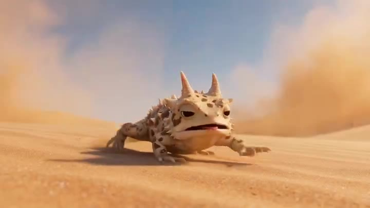
</a>

**[View the Desert Horned Lizard Grapefruit Ad video prompt](https://kinovi.ai/blogs/awesome-seedance-2-5-video-prompts#18-desert-horned-lizard-grapefruit-ad)**

</div>

#### 📌 Details

- **Source:** [Volcano Ark Seedance 2.5 Promotion Page](https://ark.volcengine.com/promotion?modelName=seedance-2-5)
- **Category:** Reference Generation
- **Reference Inputs:** 1

---

### No. 19: Youth Racing Short Film


#### 📖 Description

Youth Racing Short Film is a Seedance 2.5 reference generation case from the Volcano Ark Seedance 2.5 promotion page, preserving the original scene direction, timing notes, visual style, and reference placeholders.

#### 📝 Prompt

```
A 30-second cinematic youth racing story in 2D animation style. The protagonist is a young rider driving a motorcycle in a high-level race. The overall style is passionate, youthful, emotionally strong, and cinematic, with a complete beginning, development, turn, and conclusion, and a clear emotional arc. Use only two kinds of camera movement: high-speed follow shots and slow-motion orbit shots. Dialogue is minimal and should appear naturally like fragments of memory: sincere, gentle, restrained, not slogan-like, and not overly sentimental. Avoid disaster tone, negative expression, or exaggerated sci-fi. Focus on love, support, comeback, and upward flight within youth racing.
0-6s: High-speed follow shot. The rider starts the race, engines roaring. The camera follows close to the rear wheel and side profile. The city track, lights, and speed lines pass rapidly.
6-12s: Slow-motion orbit. The rider remembers a gentle voice and a supporting hand. Brief memory flashes appear through light and motion, not full dialogue.
12-20s: High-speed follow. The rider accelerates through a curve, overtaking others with clean motion. The rhythm becomes hotter and brighter.
20-27s: Slow-motion orbit. The motorcycle leaps briefly in the air. Memories bloom behind the rider as warm light and flowers. A gentle smiling voice says, "Go on."
27-30s: The camera circles the motorcycle in midair in slow motion. Push the emotions of passion, tenderness, freedom, and upward flight to the climax. Floral effects open behind the rider, then "seedance" appears based on <<<image_1_1>>>.
```

#### 🎬 Video

<div align="center">

<a href="https://kinovi.ai/blogs/awesome-seedance-2-5-video-prompts#19-youth-racing-short-film">
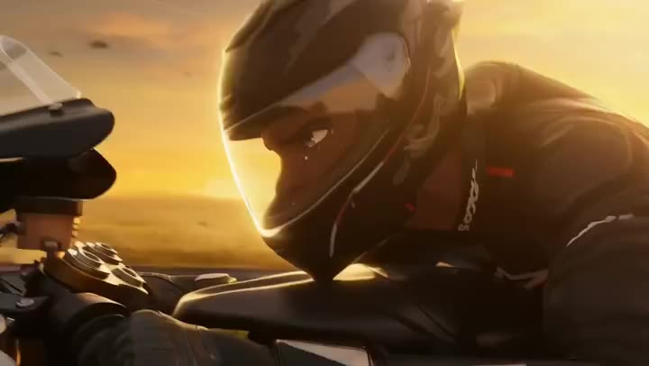
</a>

**[View the Youth Racing Short Film video prompt](https://kinovi.ai/blogs/awesome-seedance-2-5-video-prompts#19-youth-racing-short-film)**

</div>

#### 📌 Details

- **Source:** [Volcano Ark Seedance 2.5 Promotion Page](https://ark.volcengine.com/promotion?modelName=seedance-2-5)
- **Category:** Reference Generation
- **Reference Inputs:** 1

---

### No. 20: FPV Multilingual Landscape Flight


#### 📖 Description

FPV Multilingual Landscape Flight is a Seedance 2.5 reference generation case from the Volcano Ark Seedance 2.5 promotion page, preserving the original scene direction, timing notes, visual style, and reference placeholders.

#### 📝 Prompt

```
A one-shot FPV drone first-person video, 33 seconds of continuous long take with no edits, jump cuts, or transitions. The camera begins inside high-altitude clouds and follows a continuous descending flight path through clouds, mist, light and shadow, valleys, waterfalls, lake surface, flower fields, city architecture, and a ground-level plaza. The video sequentially presents 11 clear and independent language display blocks. Each block shows only its corresponding single-language text, with no mixing, no overlay, and no additional languages.
0-3s: In <<<image_1_1>>>, clouds naturally form the first text block.
3-6s: The camera passes through mist and mountain light. The next language text appears formed by drifting vapor.
6-9s: The shot dives along a waterfall. The text is shaped from falling water and spray.
9-12s: It skims across a lake. Reflections on the water surface form another language block.
12-15s: It flies above a flower field. Petals and color bands form the next text.
15-18s: It enters an old street. Signs, flags, or architecture create a single-language display.
18-21s: It passes through a modern city canyon. Glass reflections and LED surfaces shape the next block.
21-24s: The camera moves through a plaza with people and light banners. Another language appears clearly.
24-27s: It dives close to the ground, where shadows and pavement patterns form text.
27-30s: The camera rises slightly. Multiple light paths guide the viewer toward the final language block.
30-33s: The shot arrives at an open plaza. All previous visual elements converge into a clean final composition, while still keeping each language display clear and separate.
```

#### 🎬 Video

<div align="center">

<a href="https://kinovi.ai/blogs/awesome-seedance-2-5-video-prompts#20-fpv-multilingual-landscape-flight">
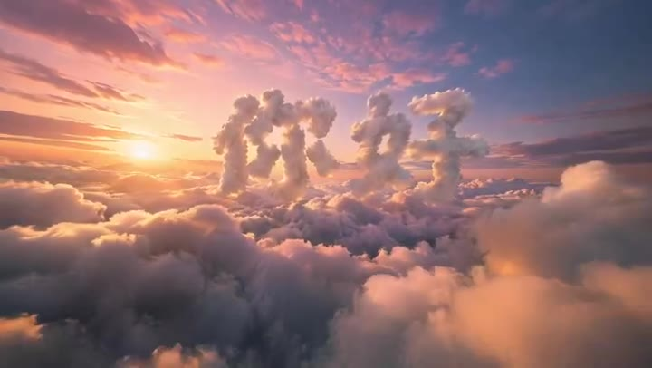
</a>

**[View the FPV Multilingual Landscape Flight video prompt](https://kinovi.ai/blogs/awesome-seedance-2-5-video-prompts#20-fpv-multilingual-landscape-flight)**

</div>

#### 📌 Details

- **Source:** [Volcano Ark Seedance 2.5 Promotion Page](https://ark.volcengine.com/promotion?modelName=seedance-2-5)
- **Category:** Reference Generation
- **Reference Inputs:** 11

---

### No. 21: Global Flower Thank-You Film


#### 📖 Description

Global Flower Thank-You Film is a Seedance 2.5 reference generation case from the Volcano Ark Seedance 2.5 promotion page, preserving the original scene direction, timing notes, visual style, and reference placeholders.

#### 📝 Prompt

```
Live-action realistic style, fast editing, cinematic, 4K, 24 fps, warm natural light, real human performance, natural lip sync, no subtitles. Use the passing of a flower as the core visual clue for the whole video. The flower moves rapidly from one country to another, connecting different regions and people around the world. In every scene, a person receives the flower, gives a sincere smile, and says "thank you" in the local language. The overall rhythm is light, smooth, and dynamic, emphasizing real street/life atmosphere, warm cross-cultural connection, and emotional transmission between people.
0-3s: The flower is handed from one person to another on a bright street. Natural smile and clear local-language "thank you".
3-6s: Match cut to another country. The handover continues through a market or everyday neighborhood.
6-9s: The flower passes through a train station, cafe, or small square. The person receiving it looks surprised, then smiles.
9-12s: A coastal or riverside street scene. Wind, sunlight, and natural camera shake add realism.
12-18s: Rapid montage through several countries. Each time, the flower remains the visual anchor while faces, clothing, streets, and languages change.
18-24s: The pace slows slightly. People from different backgrounds gather in a public space, passing the flower with warmth and laughter.
24-30s: Final wide shot. The flower returns to the center of a diverse group. Everyone looks toward the camera with gentle smiles. End on a warm, natural, globally connected feeling.
```

#### 🎬 Video

<div align="center">

<a href="https://kinovi.ai/blogs/awesome-seedance-2-5-video-prompts#21-global-flower-thank-you-film">
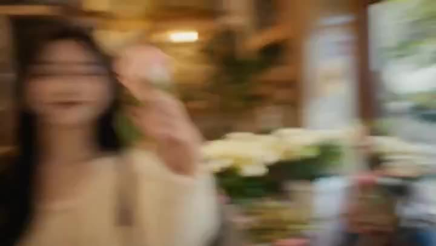
</a>

**[View the Global Flower Thank-You Film video prompt](https://kinovi.ai/blogs/awesome-seedance-2-5-video-prompts#21-global-flower-thank-you-film)**

</div>

#### 📌 Details

- **Source:** [Volcano Ark Seedance 2.5 Promotion Page](https://ark.volcengine.com/promotion?modelName=seedance-2-5)
- **Category:** Reference Generation
- **Reference Inputs:** 9

---

### No. 22: Energy Bow Jungle Edit


#### 📖 Description

Energy Bow Jungle Edit is a Seedance 2.5 video editing case from the Volcano Ark Seedance 2.5 promotion page, preserving the original scene direction, timing notes, visual style, and reference placeholders.

#### 📝 Prompt

```
Keep the character, jungle environment, camera movement, composition, action rhythm, and duration of <<<video_1_1>>> unchanged. A blue-white energy bow and glowing arrow <<<image_1_2>>> slowly appear in the character's hands. The bow gradually forms from faint electric arcs and particles, with delicate flowing current texture, slight volumetric light, and a stable energy silhouette. During the draw, the arrow condenses into a bright energy arrow at the center of the bowstring. The instant the character releases, the arrow shoots out at high speed, leaving a bright, slender, continuous, sharp energy trail.
```

#### 🎬 Video

<div align="center">

<a href="https://kinovi.ai/blogs/awesome-seedance-2-5-video-prompts#22-energy-bow-jungle-edit">
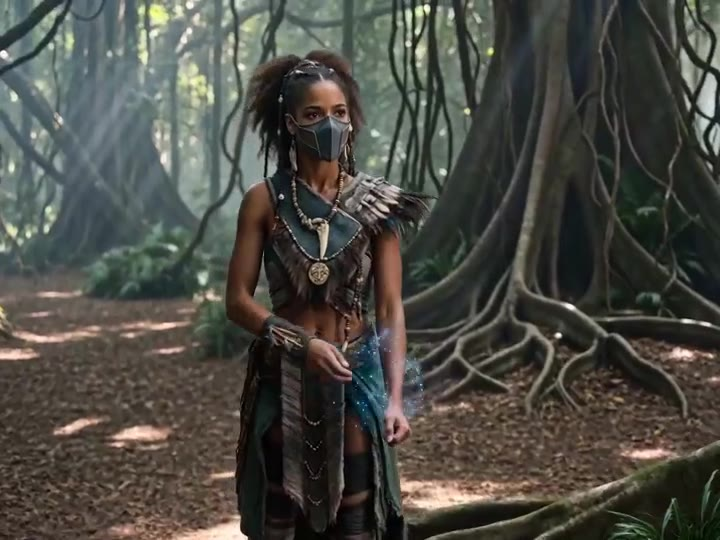
</a>

**[View the Energy Bow Jungle Edit video prompt](https://kinovi.ai/blogs/awesome-seedance-2-5-video-prompts#22-energy-bow-jungle-edit)**

</div>

#### 📌 Details

- **Source:** [Volcano Ark Seedance 2.5 Promotion Page](https://ark.volcengine.com/promotion?modelName=seedance-2-5)
- **Category:** Video Editing
- **Input Video:** [Reference video](https://ark-common-storage-prod-cn-beijing.tos-cn-beijing.volces.com/presets/experience/gen_video/model-promotion/seedance-2-5/part2/group1/reference1.mp4)
- **Reference Inputs:** 2

---

### No. 23: Drone Removal Safari Cleanup


#### 📖 Description

Drone Removal Safari Cleanup is a Seedance 2.5 video editing case from the Volcano Ark Seedance 2.5 promotion page, preserving the original scene direction, timing notes, visual style, and reference placeholders.

#### 📝 Prompt

```
Remove the drone and the lower-left foreground rail/vehicle edge from <<<video_1_1>>> and naturally inpaint the removed area. Keep the giraffe herd, tree branches, distant grassland, golden sunset backlight, atmospheric perspective, and camera composition completely unchanged. The completed background should match the surrounding environment, generating natural sky, gaps between branches, and grassland details. Avoid smearing, flicker, deformation, ghosting, or jumping. Ensure temporal consistency across frames, continuous motion, natural edges, and an overall look like original live-action footage.
```

#### 🎬 Video

<div align="center">

<a href="https://kinovi.ai/blogs/awesome-seedance-2-5-video-prompts#23-drone-removal-safari-cleanup">
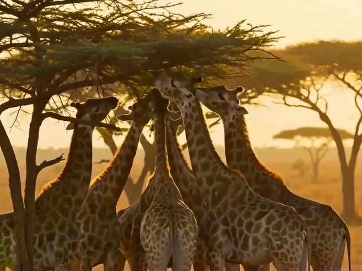
</a>

**[View the Drone Removal Safari Cleanup video prompt](https://kinovi.ai/blogs/awesome-seedance-2-5-video-prompts#23-drone-removal-safari-cleanup)**

</div>

#### 📌 Details

- **Source:** [Volcano Ark Seedance 2.5 Promotion Page](https://ark.volcengine.com/promotion?modelName=seedance-2-5)
- **Category:** Video Editing
- **Input Video:** [Reference video](https://ark-common-storage-prod-cn-beijing.tos-cn-beijing.volces.com/presets/experience/gen_video/model-promotion/seedance-2-5/part2/group2/reference1.mp4)
- **Reference Inputs:** 1

---

### No. 24: Medieval Duel Style Transfer


#### 📖 Description

Medieval Duel Style Transfer is a Seedance 2.5 video editing case from the Volcano Ark Seedance 2.5 promotion page, preserving the original scene direction, timing notes, visual style, and reference placeholders.

#### 📝 Prompt

```
Transform the plain two-person martial-arts video <<<video_1_1>>> into an empty-hand probing exchange before a cold-weapon duel. Replace the scene with a medieval stone-castle platform, ancient courtyard ground, mountain fortress exterior platform, or simple stone-brick duel arena. The background should include castle walls, wind, mist, distant mountain lines, and flat stone ground <<<image_1_2>>>. Replace the clothing of the dark-clothed man in the video with <<<image_2_3>>> and the light-clothed man with <<<image_3_4>>>. Keep the original action rhythm and body motion, but make the atmosphere more restrained, tense, and cinematic, as if the duel is about to begin.
```

#### 🎬 Video

<div align="center">

<a href="https://kinovi.ai/blogs/awesome-seedance-2-5-video-prompts#24-medieval-duel-style-transfer">
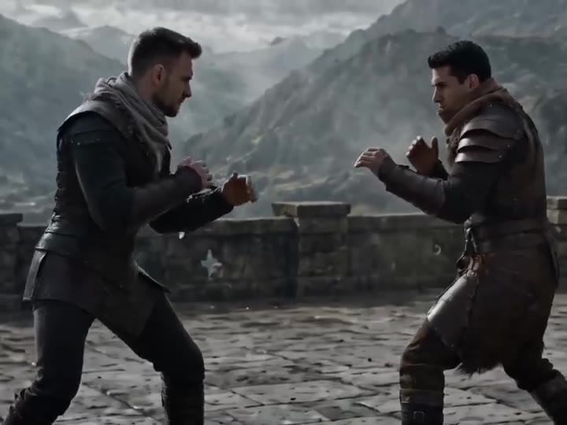
</a>

**[View the Medieval Duel Style Transfer video prompt](https://kinovi.ai/blogs/awesome-seedance-2-5-video-prompts#24-medieval-duel-style-transfer)**

</div>

#### 📌 Details

- **Source:** [Volcano Ark Seedance 2.5 Promotion Page](https://ark.volcengine.com/promotion?modelName=seedance-2-5)
- **Category:** Video Editing
- **Input Video:** [Reference video](https://ark-common-storage-prod-cn-beijing.tos-cn-beijing.volces.com/presets/experience/gen_video/model-promotion/seedance-2-5/part2/group3/reference1.mp4)
- **Reference Inputs:** 4

---

<a id="video-download-list"></a>
## 📥 Video Download List

This repository includes preview [images](images) in images, compressed archive videos under videos/, target filenames in [video-download-list.txt](video-download-list.txt), structured case data in [data/seedance-2-5-cases.json](data/seedance-2-5-cases.json), and direct source URLs in [video-urls.json](video-urls.json). The full playable gallery is available in the [Seedance 2.5 video prompt examples](https://kinovi.ai/blogs/awesome-seedance-2-5-video-prompts) article.

---

<a id="how-to-contribute"></a>
## 🤝 How to Contribute

Contributions are welcome. You can help by adding new Seedance 2.5 prompts, improving translations, adding thumbnail previews or video links, or refining descriptions and metadata.

1. Fork the repository
2. Add or improve prompts and media links
3. Keep source attribution clear
4. Submit a pull request

---

<a id="license"></a>
## 📄 License

This project is licensed under the [Creative Commons Attribution 4.0 International License](https://creativecommons.org/licenses/by/4.0/).

---

<a id="acknowledgements"></a>
## 🙏 Acknowledgements

- [Volcano Ark](https://ark.volcengine.com/) for the Seedance 2.5 promotion page and public case materials
- [YouMind-OpenLab/awesome-seedance-2-prompts](https://github.com/YouMind-OpenLab/awesome-seedance-2-prompts) for the original README structure reference
- The Seedance and creative AI communities for prompt engineering inspiration
